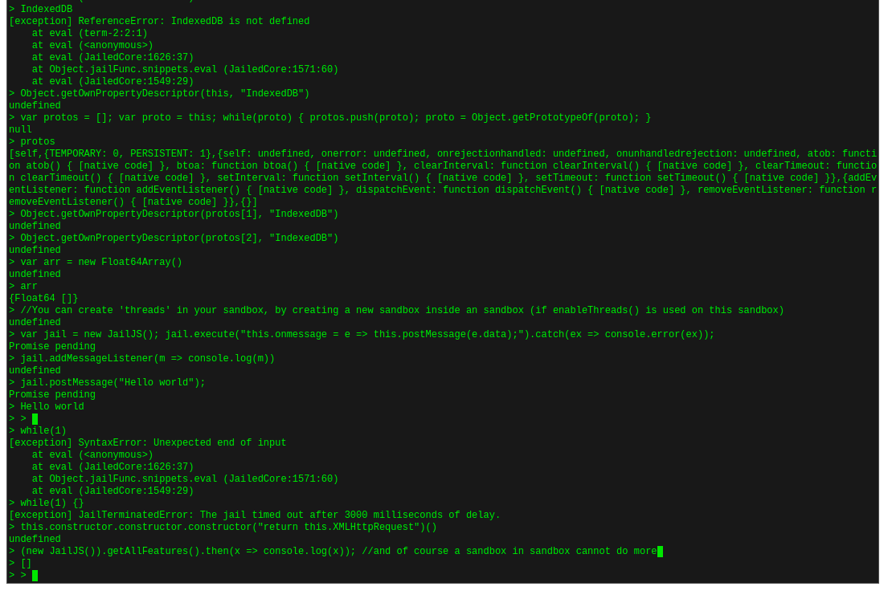

# JailJS

Run untrusted javascript code in your browser, securely. With a rich API you can run a lot of different things in this sandbox. Including webassembly, binary data, API functions and javascript programs using multiple workers, 

## Getting Started

There are no other libraries required for this library. The only thing that is required is a browser that supports Web Workers and Ecmascript 2015.

You need to add both 'jailjs.js' and 'jailed.js' to your project, but only include 'jailjs.js' (it is not a module) as a source file. The 'jailed.js' is the source code for the worker where the jailed code is going to be executed in. You can change the 'jailedPath' variable in jailjs.js to change the location of the jailed.js file.

Sandbox demo: https://olifon.github.io/sandbox-js/terminal.html



termlib.js, test.js, test.html and terminal.html are used for the DEMO (not part of the library). You only need jailed.js and jailjs.js, just copy paste them in your project.


Examples:

```Javascript
var jail = new JailJS();
var root = jail.root;

root.set('print', console.log);
jail.execute('print("Hello from sandboxed code!");');
jail.terminate();
```

```Javascript
(async function() {
    var jail = new JailJS();
    var root = jail.root;

    console.log(await (await jail.execute('(function(x, y) {return x + " " + y;})')).invoke(['Hello', 'World']));
    jail.terminate();
})();
```

**NOTE**: Do not whitelist objects like XMLHttpRequest for untrusted code. The Worker runs with the same origin as the website. This means it can access all the cookies, storages (like indexed db) etc. All of this is disabled by default of course and only vanilla JS objects are exposed. Try to create own API functions, that validates data, and expose them to the sandbox with root.set.

Example of a malicious program:
```Javascript
(async function() {
    var jail = new JailJS();
    var root = jail.root;

    jail.ping().then(() => console.log("pong"))

    console.log(await root.get("String")); //JailObject
    console.log(await root.get("Number")); //JailObject
    
    //malicious code deletes all core objects (or modifies it)
    await jail.execute('Object.prototype.toString = function() {throw new Error("Nope");}');
    await jail.execute('for(var item of Object.getOwnPropertyNames(self)) { try { delete self[item]; } catch(ex) {} }'); //no error
    await jail.execute('Symbol = function() {throw new Error("Nope");}'); //no error
    await jail.execute('self.String = function() {throw new Error("Haha, no");}'); //no error

    console.log(await root.get("String")); //JailObject
    console.log(await root.get("Number")); //undefined
    console.log((await jail.execute("'It still ' + 'works'"))); //It still works
    console.log((await jail.execute("3n+3n+5n+6n"))); //17n
    console.log(await (await jail.execute('(function(x, y) {return x + " " + y;})')).invoke(['Hello', 'World'])); //Hello world
    root.set('print', console.log);
    var sym = Symbol("Hi");
    root.set('sym', sym)
    root.set('sym2', Symbol('Hello'));
    jail.execute('print("Also with symbols:", sym);') //Also works with Symbols: Symbol(Hi)
    console.log((await root.get('sym')) == sym); //true
    console.log((await root.get('sym2')) == sym); //false
    jail.execute('while(1){}');
    //important, do the timeout after executing malicious code. It does a jail.ping() and if it does not respond it will kill the jail.
    jail.timeoutAfter(500).catch(ex => console.error(ex)); //The jail timed out after 500 milliseconds of delay.
})();
```


## License
This project is licensed under the MIT License - see the [LICENSE.md](LICENSE.md) file for details
